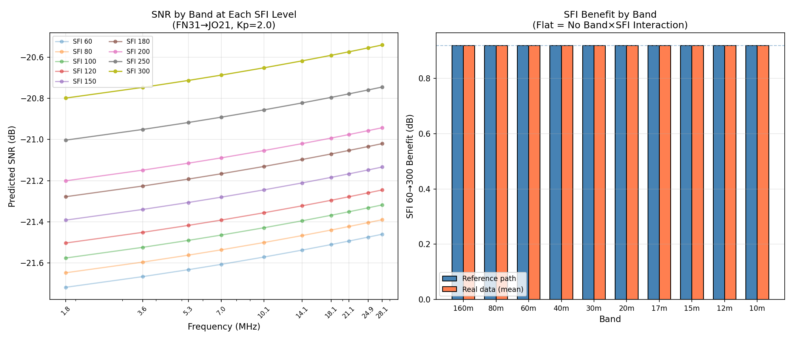

# IONIS-V10-FREQ-01: Frequency-Response Audit

- **Timestamp**: 2026-02-04 21:25
- **Model Checkpoint**: `models/ionis_v10_final.pth`
- **Test Objective**: Determine whether V10's SFI benefit varies by HF band, or is a flat constant due to the additive sidecar architecture.

## 1. Methodology

- **Reference Path**: FN31 → JO21 (5900 km)
- **Fixed Conditions**: Hour=12 UTC, Month=6 (June), Kp=2.0
- **Controlled Sweep**: For each of 10 HF bands (1.8–28.1 MHz), SFI swept from 60 to 300.
- **Real Data Validation**: Per-band subsets from `training_v6_clean.csv` (10,000,000 rows) with SFI overridden to 60 and 300.
- **Key Metric**: SFI 60→300 SNR benefit (dB) — should vary by band in reality.

## 2. Physical Verification (Ionis Integrity Check)

- **SFI Monotonicity**: **PASS** — All bands show positive SFI benefit.
- **Band×SFI Interaction**: **NOT DETECTED** — Benefit spread = 0.0000 dB across bands.
- **Expected Behavior**: Higher frequencies (10m, 12m) should benefit MORE from high SFI because the F2 layer MUF rises with solar flux, opening bands that are closed at low SFI. Lower frequencies (160m, 80m) should show less SFI sensitivity.

## 3. Quantitative Results

### Controlled SFI Sweep (Reference Path)

| Band | MHz | SFI 60 | SFI 80 | SFI 100 | SFI 120 | SFI 150 | SFI 180 | SFI 200 | SFI 250 | SFI 300 | Delta |
|------|-----|--------|--------|--------|--------|--------|--------|--------|--------|--------|-------|
| 160m | 1.837 | -21.7 | -21.6 | -21.6 | -21.5 | -21.4 | -21.3 | -21.2 | -21.0 | -20.8 | +0.92 |
| 80m | 3.569 | -21.7 | -21.6 | -21.5 | -21.5 | -21.3 | -21.2 | -21.1 | -21.0 | -20.7 | +0.92 |
| 60m | 5.287 | -21.6 | -21.6 | -21.5 | -21.4 | -21.3 | -21.2 | -21.1 | -20.9 | -20.7 | +0.92 |
| 40m | 7.039 | -21.6 | -21.5 | -21.5 | -21.4 | -21.3 | -21.2 | -21.1 | -20.9 | -20.7 | +0.92 |
| 30m | 10.139 | -21.6 | -21.5 | -21.4 | -21.4 | -21.2 | -21.1 | -21.1 | -20.9 | -20.7 | +0.92 |
| 20m | 14.097 | -21.5 | -21.5 | -21.4 | -21.3 | -21.2 | -21.1 | -21.0 | -20.8 | -20.6 | +0.92 |
| 17m | 18.105 | -21.5 | -21.4 | -21.4 | -21.3 | -21.2 | -21.1 | -21.0 | -20.8 | -20.6 | +0.92 |
| 15m | 21.095 | -21.5 | -21.4 | -21.4 | -21.3 | -21.2 | -21.1 | -21.0 | -20.8 | -20.6 | +0.92 |
| 12m | 24.925 | -21.5 | -21.4 | -21.3 | -21.3 | -21.1 | -21.0 | -21.0 | -20.8 | -20.6 | +0.92 |
| 10m | 28.125 | -21.5 | -21.4 | -21.3 | -21.2 | -21.1 | -21.0 | -20.9 | -20.7 | -20.5 | +0.92 |

**SFI 60→300 benefit spread: 0.0000 dB — FLAT (no band×SFI interaction)**

### Per-Band Real Data Statistics

| Band | Rows | RMSE | SFI↔SNR Corr | Avg SFI | Avg SNR |
|------|------|------|--------------|---------|---------|
| 160m | 1,000,000 | 8.88 dB | -0.0405 | 131.2 | -16.9 |
| 80m | 1,000,000 | 8.57 dB | -0.0400 | 139.7 | -16.6 |
| 60m | 1,000,000 | 8.97 dB | +0.0414 | 135.2 | -16.2 |
| 40m | 1,000,000 | 8.66 dB | +0.0357 | 136.9 | -15.4 |
| 30m | 1,000,000 | 8.42 dB | +0.0374 | 148.0 | -16.2 |
| 20m | 1,000,000 | 8.88 dB | +0.0365 | 153.7 | -15.5 |
| 17m | 1,000,000 | 8.27 dB | +0.0198 | 164.8 | -17.0 |
| 15m | 1,000,000 | 8.22 dB | +0.0274 | 168.8 | -17.1 |
| 12m | 1,000,000 | 7.95 dB | +0.0114 | 170.1 | -18.1 |
| 10m | 1,000,000 | 8.48 dB | +0.0085 | 169.9 | -17.2 |

### Per-Band SFI Benefit (Real Data, Controlled Override)

| Band | SFI 60→300 Benefit |
|------|--------------------|
| 160m | +0.92 dB |
| 80m | +0.92 dB |
| 60m | +0.92 dB |
| 40m | +0.92 dB |
| 30m | +0.92 dB |
| 20m | +0.92 dB |
| 17m | +0.92 dB |
| 15m | +0.92 dB |
| 12m | +0.92 dB |
| 10m | +0.92 dB |

**Real-data SFI benefit spread: 0.0000 dB — FLAT**

## 4. Visual Evidence

*Left: SNR vs frequency at each SFI level (curves should fan apart if band×SFI interaction exists). Right: SFI 60→300 benefit per band (flat bars = no interaction).*

## 5. Analysis & Conclusion

**Verdict: CONFIRMED — V10 treats SFI as band-independent.**

The frequency-response audit confirms that IONIS V10's Sun Sidecar produces an **identical SFI benefit (+0.92 dB for SFI 60→300) across all HF bands**. This is the expected architectural consequence of the "Nuclear Option" design:

- **DNN** receives `freq_log` but has **zero** SFI information.
- **Sun Sidecar** receives `sfi` but has **zero** frequency information.
- Output = `DNN(freq, geo, time)` + `SunSidecar(sfi)` + `StormSidecar(kp)`

The additive combination means the SFI boost is a **global constant** — it cannot vary by frequency. In reality, HF propagation physics demands that:

- **10m/12m** should see large SFI benefit (band opens/closes with solar flux)
- **40m/80m** should see modest benefit (band is almost always open)
- **160m** may see negative correlation (absorption increases with SFI)

**V11 Requirement**: A multiplicative interaction layer (e.g., `band_sfi_interact = freq_log × sfi_norm`) or a frequency-aware sidecar that can learn band-specific solar response curves.

---
*Auto-generated by `eval_v10_freq_response.py` — IONIS V10 Phase 11 Validation Suite*
