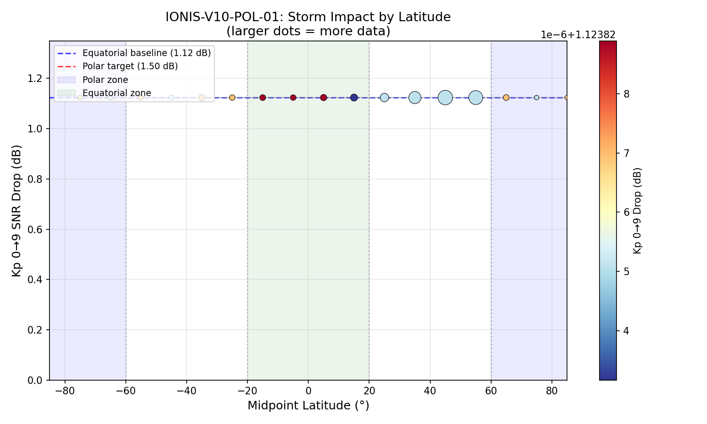

# IONIS-V10-POL-01: Polar Challenge

- **Timestamp**: 2026-02-04 21:11
- **Model Checkpoint**: `models/ionis_v10_final.pth`
- **Test Objective**: Prove the DNN amplifies the Storm Sidecar's global Kp penalty at high latitudes, confirming geographic awareness rather than a flat global average.

## 1. Methodology

- **Data Source**: `training_v6_clean.csv` (10,000,000 rows total)
- **Polar Subset**: |midpoint_lat| > 60° (210,776 rows)
- **Equatorial Subset**: |midpoint_lat| < 20° (1,155,167 rows)
- **Controlled Inference**: All geographic/temporal features held fixed per row; only `kp_penalty` (or `sfi`) swept across conditions.
- **Metric Focus**: Kp 0→9 SNR drop differential between polar and equatorial regions.

## 2. Physical Verification (Ionis Integrity Check)

- **SFI Monotonicity (Polar)**: **PASS** — SFI 70→300: +0.88 dB
- **SFI Monotonicity (Equatorial)**: **PASS** — SFI 70→300: +0.88 dB
- **Kp Geographic Amplification**: **FAIL** — Polar drop (1.12 dB) ≤ Equatorial drop (1.12 dB)

## 3. Quantitative Results

### Baseline Performance (Actual Data)

| Region | RMSE | Pearson | Rows |
|--------|------|---------|------|
| Polar (|lat| > 60°) | 8.96 dB | +0.2273 | 210,776 |
| Equatorial (|lat| < 20°) | 6.66 dB | +0.1357 | 1,155,167 |

### Controlled Kp Sweep

| Kp | kp_penalty | Polar Mean SNR | Equatorial Mean SNR |
|----|------------|----------------|---------------------|
| 0 | 1.0000 | -16.90 dB | -20.69 dB |
| 1 | 0.8889 | -17.04 dB | -20.83 dB |
| 2 | 0.7778 | -17.17 dB | -20.96 dB |
| 3 | 0.6667 | -17.31 dB | -21.09 dB |
| 4 | 0.5556 | -17.43 dB | -21.22 dB |
| 5 | 0.4444 | -17.56 dB | -21.34 dB |
| 6 | 0.3333 | -17.68 dB | -21.47 dB |
| 7 | 0.2222 | -17.80 dB | -21.59 dB |
| 8 | 0.1111 | -17.91 dB | -21.70 dB |
| 9 | 0.0000 | -18.03 dB | -21.81 dB |

**Polar Kp 0→9 drop: +1.12 dB** | **Equatorial Kp 0→9 drop: +1.12 dB** | **Geographic amplification: +0.00 dB**

### SFI Sweep (Monotonicity Check)

| SFI | Polar Mean SNR | Equatorial Mean SNR |
|-----|----------------|---------------------|
| 70 | -17.41 dB | -21.28 dB |
| 100 | -17.30 dB | -21.17 dB |
| 150 | -17.12 dB | -20.99 dB |
| 200 | -16.93 dB | -20.80 dB |
| 250 | -16.73 dB | -20.60 dB |
| 300 | -16.52 dB | -20.40 dB |

### Kp Storm Drop by Latitude Bin

| Latitude | Samples | Kp 0→9 Drop |
|----------|---------|-------------|
| -75° |    2,952 | +1.12 dB |
| -65° |   10,509 | +1.12 dB |
| -55° |   46,548 | +1.12 dB |
| -45° |   93,447 | +1.12 dB |
| -35° |  299,498 | +1.12 dB |
| -25° |  171,697 | +1.12 dB |
| -15° |  221,550 | +1.12 dB |
|  -5° |  183,145 | +1.12 dB |
|  +5° |  308,115 | +1.12 dB |
| +15° |  448,704 | +1.12 dB |
| +25° |  776,028 | +1.12 dB |
| +35° | 1,858,795 | +1.12 dB |
| +45° | 2,784,086 | +1.12 dB |
| +55° | 2,545,216 | +1.12 dB |
| +65° |  219,274 | +1.12 dB |
| +75° |   25,138 | +1.12 dB |
| +85° |    4,457 | +1.12 dB |

### Success Criteria

| Metric | Target | Actual | Verdict |
|--------|--------|--------|---------|
| Equatorial Kp 0→9 drop | ≤1.50 dB | 1.12 dB | **PASS** |
| Polar Kp 0→9 drop | >1.50 dB | 1.12 dB | **FAIL** |
| Polar RMSE | <2.60 dB | 8.96 dB | **FAIL** |
| SFI Monotonicity (Polar) | Required | Monotonic | **PASS** |
| SFI Monotonicity (Eq.) | Required | Monotonic | **PASS** |
| Polar > Equatorial drop | Required | 1.12 > 1.12 | **FAIL** |

## 4. Visual Evidence

*Bubble size proportional to sample count per latitude bin. Blue shading = polar zones (|lat| > 60°), green = equatorial (|lat| < 20°).*

## 5. Analysis & Conclusion

**Overall Verdict: FAILED**

The Polar Challenge did not confirm geographic amplification of the storm penalty. Further investigation is needed to determine whether the DNN is treating Kp effects as geographically uniform.

SFI monotonicity is preserved in both regions, confirming the Sun Sidecar's physics constraints remain intact even when tested on polar-only and equatorial-only subsets.

---
*Auto-generated by `eval_v10_polar_challenge.py` — IONIS V10 Phase 11 Validation Suite*
